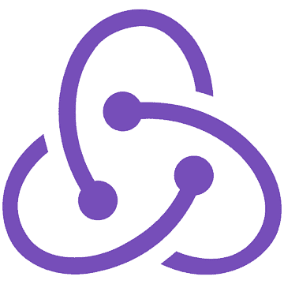
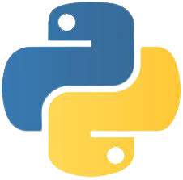
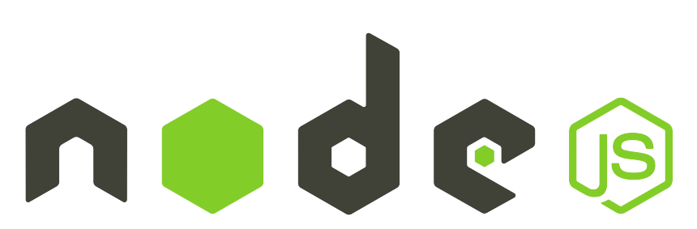

## 👋 Olá, Mundo! Eu sou Rolwane.

 

Desenvolvedor Front-end, gosto de café, música, tocar instrumentos e sou muito fã de Foo Fighters! 🤟

Também gosto muito de tecnologia! <s>por essa você não esperava, não é mesmo?</s> Sempre fui fascinado pelo mundo do desenvolvimento de software e desde sempre estudei sozinho nessas internets por aí. Fiz 3 anos de Ciência da Computação e atualmente estudo na Trybe buscando a formação de Full Stack!

 
 

###  Tecnologias que estou apto a trabalhar 🚀

 

 

 
 

###  Tecnologias que estou estudando 🚀

 
 

### Conecte-se comigo no Linkedin!

 

